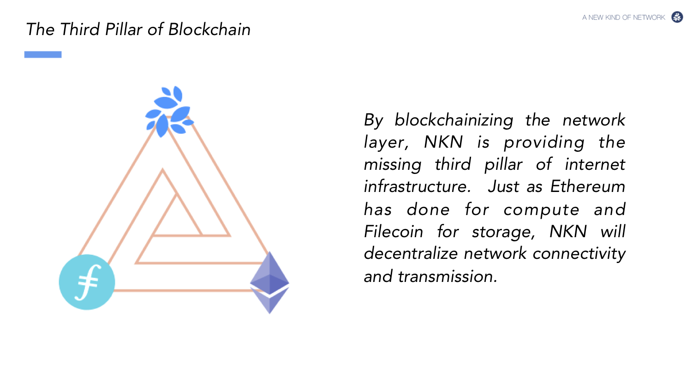

> 📖🔍 Documents of the NKN Name Service.

## 💡 What is NKN?
NKN is a new kind of network connectivity protocol & ecosystem powered by blockchain for an open, decentralized, and shared Internet. 

## 💡 What is BNS?
BNS – or blockchain name system – is the protocol on the internet that turns human-comprehensible decentralized website names such as ‘website.xem’ or ‘mywebsite.xem’ into addresses understandable by decentralized network machines.

## 📝 Description

NNS is the NKN Name Service, a distributed, open, and extensible naming system based on the NKN blockchain.

## 📚 Documents

#### Table of Contents
- [Introduction](./docs/INTRODUCTION.md)
- [Implementation](./docs/IMPLEMENTATION.md)
    - [Registry](./docs/REGISTRY.md)
    - [Registrar](./docs/REGISTRAR.md)
    - [Resolver](./docs/RESOLVER.md)
- [Integration](./docs/INTEGRATION.md)

## Tech Stack

## 📃 Introduction
NKN is the next generation of peer to peer network infrastructure built upon blockchain technology backed by Cellular Automata theory aiming at revolutionizing the Internet with true decentralization and native token incentive mechanism. NKN introduced the concept of Decentralized Data Transmission Network (DDTN). DDTN combines multiple independent and self-organized relay nodes to provide clients with connectivity and data transmission capability.

NKN introduces `Proof of Relay` as consensus mechanism and incentive model which encourages people to join the network to share and enhance network connectivity and data transmission. In short, the reward is depending on the data amount of a node relays. It makes whole network retain high efficiency as well. The "mining" is redefined as contributing to the data transmission layer, and the only way to get more rewards is providing more transmission power.

### 📨 Proof of Relay
Proof of Relay is a useful proof of work, it redefines mining as relaying data. PoR's implementation is basded on a special `signature chain`. In simple terms, the PoR signature chain is a hash chain that relay nodes sign in turn when relaying data packets. 

In the PoR algorithm, the bookkeeper candidate vote is not a vote of a person or IP address, but a vote of a signature chain.

## 📣 Contributing
See [CONTRIBUTING.md](./CONTRIBUTING.md) for how to help out.

## 🗒 Licence
See [LICENSE](./LICENSE) for details.
